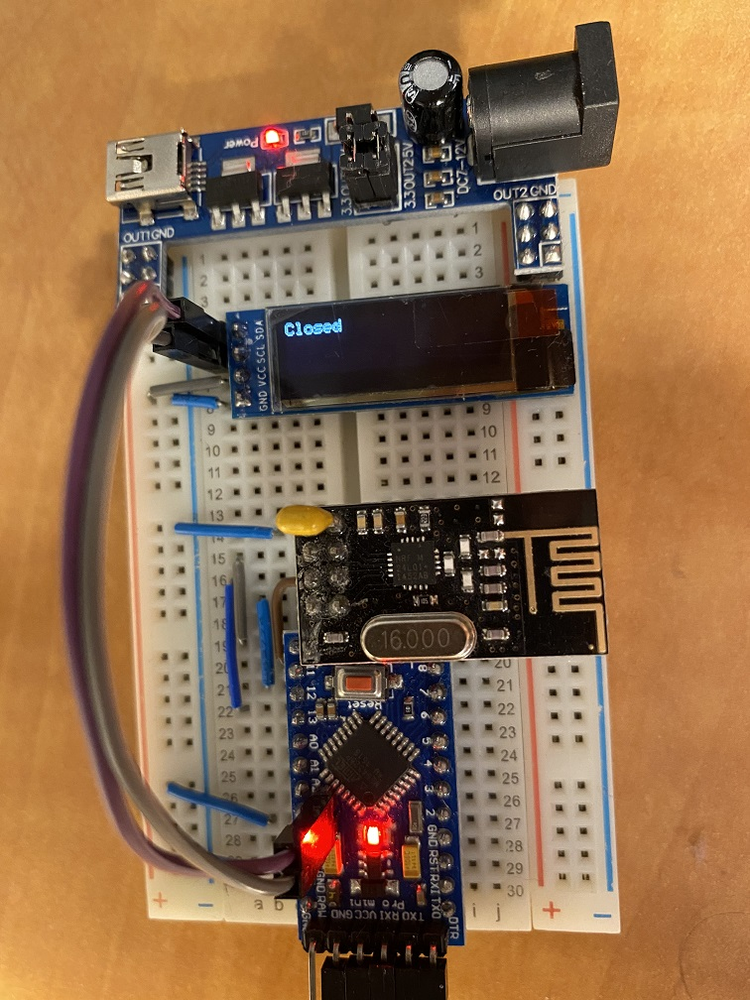

# arduino-rf24-basic-oled

Arduino, NRF24L01 and 128x32 OLED via I2C

Wiring
* NRF24L01: Standard SPI connection to Arduino with [CS, CE] pins connected to [9, 10]
* SSD1306 OLED display connected to I2C

